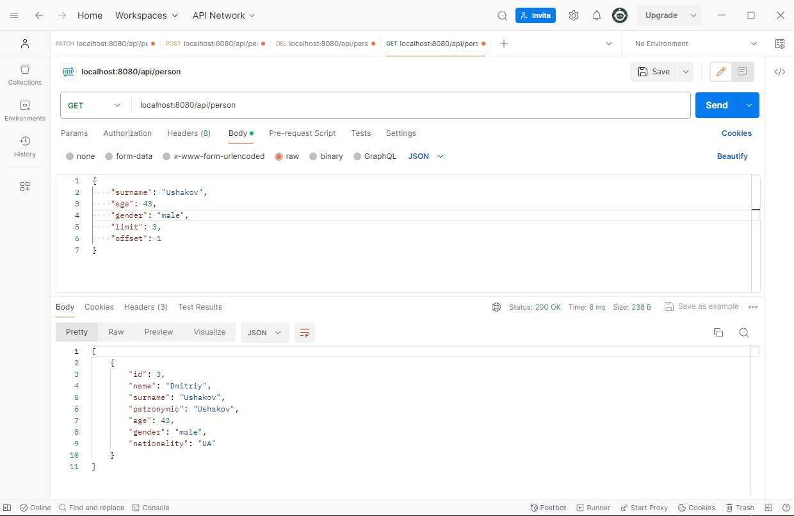
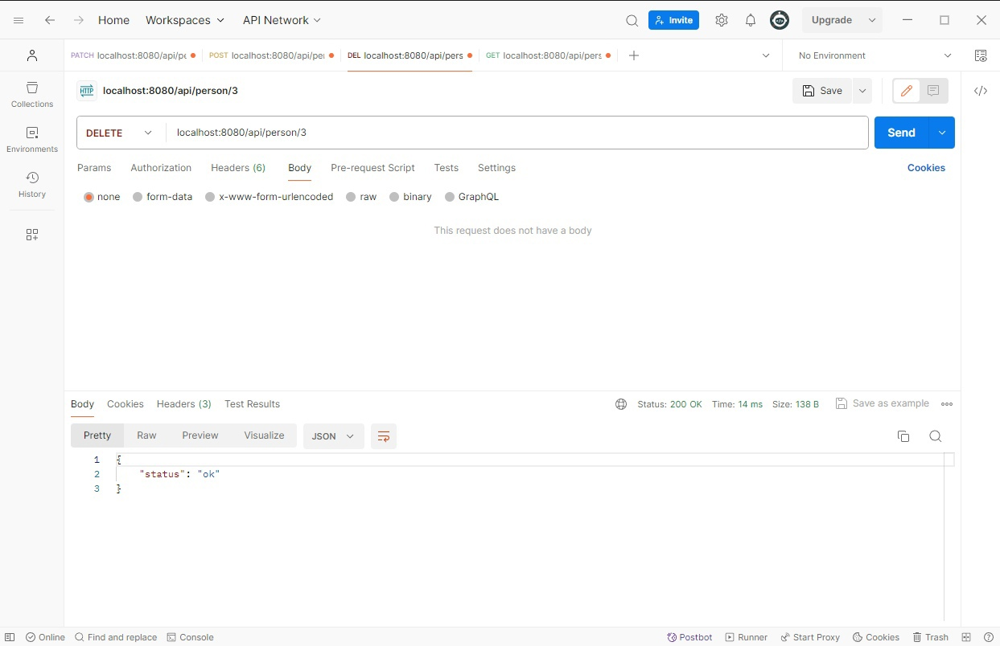
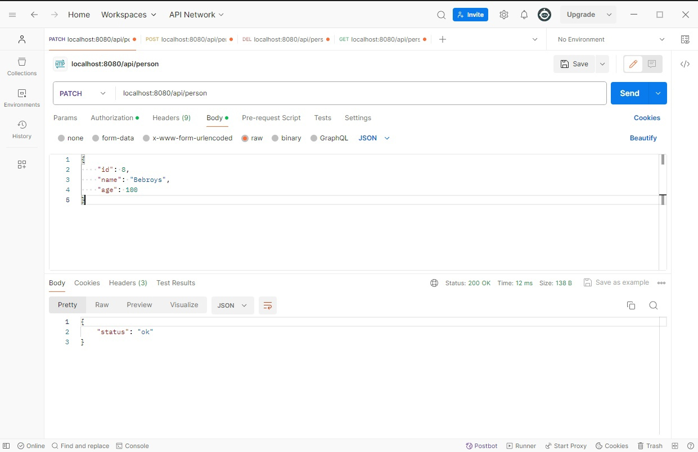
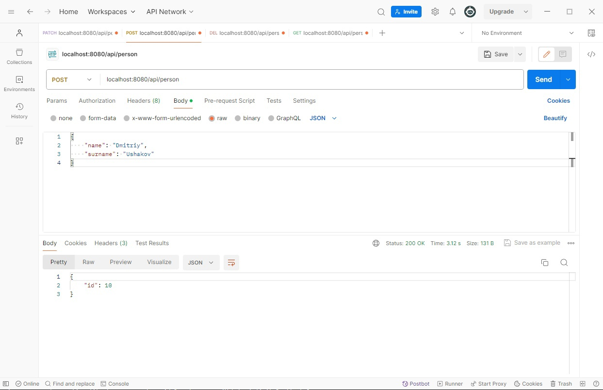

# О проделанном  
По сравнению с предыдущими сервисами тут дополнительно реализована работа с сторонними сервисами, а также http методами (sql запросами при работе с ними)  

# О сервисе  
Сервис поддерживает 4 метода:  
1. Get - получение списка пользователей по выбранному фильтру  
2. Delete - удаление пользователя по идентификатору  
3. Patch - изменение пользователя по выбранным параметрам  
4. Post - добавления пользователя в базу с обогащением информации о нем  

# Подробнее о методах  
Get - Get_People  
Запрос - Ожидает получения структуры пользователя состоящей из id, name, surname, patronymic, age, gender, nationality и limit, offset (Большинство является фильтром и пользователь сам может выбирать какие элементы структуры указывать)  
Ответ - [{"id": 3,"name": "Dmitriy","surname": "Ushakov","patronymic": "Ushakov","age": 43,"gender": "male","nationality": "UA"}...]  

  

Delete - Delete_People  
Запрос - Ожидает получить идентификатор внутри запроса  
Ответ - {"message": "no id found"} / {"message": "ok"}  

  

Patch - Patch_People  
Запрос - Ожидает получения структуры пользователя состоящей из id, name, surname, patronymic, age, gender, nationality (Если фрагмент структуры пустой или не указан, то ничего не меняется в нем)  
Ответ - {"message": "no id found"} / {"message": "ok"}  

  

Post - Post_People  
Запрос - Ожидает получения структуры человека состоящей из name, surname, patronymic (patronymic не обязателен, в случае отсутствия ставится пустая строка)  
Ответ - {"id": 10}  

  

# Что хотелось бы еще сделать  
- Готовые команды в makefile  
- Запуск из docker-compose  
- Unit тестирование  

Буду рад получить фидбэк / советы!  
Почта - 1pyankov.d.s@gmail.com  
Телега - @Xonesent  